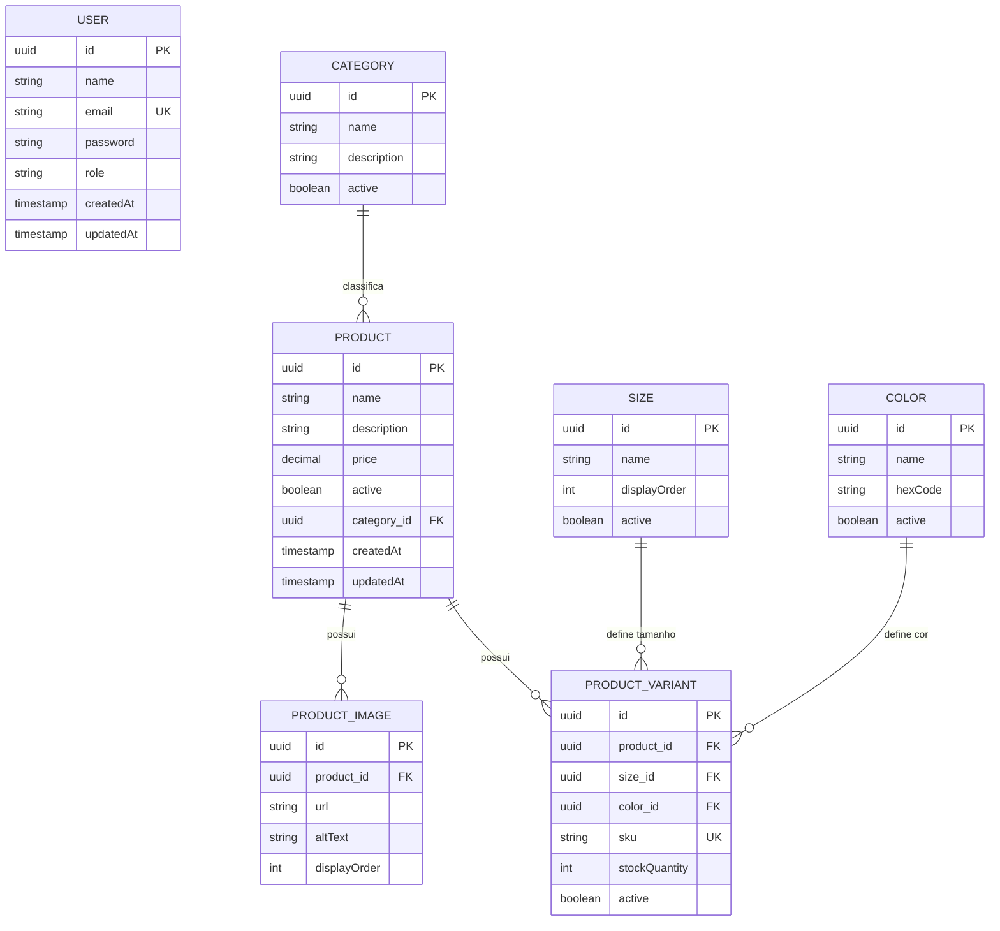

# Diagrama ER — Loja de Roupas

```mermaid
erDiagram
    USER {
        uuid id PK
        string name
        string email UK
        string password
        string role
        timestamp createdAt
        timestamp updatedAt
    }

    CATEGORY {
        uuid id PK
        string name
        string description
        boolean active
    }

    PRODUCT {
        uuid id PK
        string name
        string description
        decimal price
        boolean active
        uuid category_id FK
        timestamp createdAt
        timestamp updatedAt
    }

    PRODUCT_IMAGE {
        uuid id PK
        uuid product_id FK
        string url
        string altText
        int displayOrder
    }

    SIZE {
        uuid id PK
        string name
        int displayOrder
        boolean active
    }

    COLOR {
        uuid id PK
        string name
        string hexCode
        boolean active
    }

    PRODUCT_VARIANT {
        uuid id PK
        uuid product_id FK
        uuid size_id FK
        uuid color_id FK
        string sku UK
        int stockQuantity
        boolean active
    }

    CATEGORY ||--o{ PRODUCT : "classifica"
    PRODUCT ||--o{ PRODUCT_IMAGE : "possui"
    PRODUCT ||--o{ PRODUCT_VARIANT : "possui"
    SIZE ||--o{ PRODUCT_VARIANT : "define tamanho"
    COLOR ||--o{ PRODUCT_VARIANT : "define cor"
```
